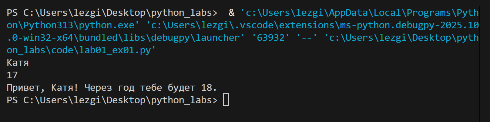
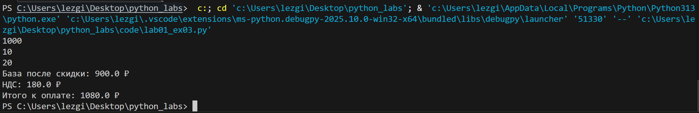
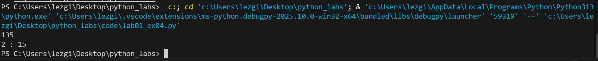
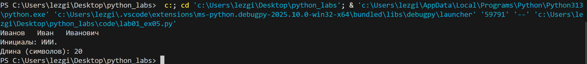

# __Лабораторная работа 1__
## задание 1
```
a = input()
b = int(input())
c = b + 1
print(f"Привет, {a}! Через год тебе будет {c}.")
```

## задание 2
```
a = float(input())
b = float(input())
summ = a + b
avg = round((a + b)/2, 2)
![02]print(f"sum={summ}; avg={avg}")
```
(./images/lab01_ex02.png)
## задание 3
```
price = float(input())
discount = float(input())
vat = float(input())

base = round(price * (1 - discount/100), 2)
vat_amount = round(base * (vat/100), 2)
total = round(base + vat_amount, 2)

print(f"База после скидки: {base} ₽")
print(f"НДС: {vat_amount} ₽")
print(f"Итого к оплате: {total} ₽")
```

## задание 4
```
min = int(input())
hours = min//60
ost_min = min%60
print(f"{hours} : {ost_min}")
```

## задание 5
```
name = input()
m = len(name.replace('  ', ''))
nam = name.strip().split()
n = []
for i in nam:
    a = i[0]
    n.append(a)
h = ''.join(n)
print(f"Инициалы: {h}.")
print(f"Длина (символов): {m}")
```

