# __Лабораторная работа 1__
## задание 1
```
a = input()
b = int(input())
c = b + 1
print(f"Привет, {a}! Через год тебе будет {c}.")
```

## задание 2
```
a = float(input())
b = float(input())
summ = a + b
avg = round((a + b)/2, 2)
print(f"sum={summ}; avg={avg}")
```

## задание 3
```
price = float(input())
discount = float(input())
vat = float(input())

base = round(price * (1 - discount/100), 2)
vat_amount = round(base * (vat/100), 2)
total = round(base + vat_amount, 2)

print(f"База после скидки: {base} ₽")
print(f"НДС: {vat_amount} ₽")
print(f"Итого к оплате: {total} ₽")
```

## задание 4
```
min = int(input())
hours = min//60
ost_min = min%60
print(f"{hours} : {ost_min:02d}")
```

## задание 5
```
name = input().strip()
nam = name.split()
m = len(''.join(nam))+2
n = []
for i in nam:
    a = i[0]
    n.append(a)
h = ''.join(n)
print(f"Инициалы: {h}.")
print(f"Длина (символов): {m}")
```


# __Лабораторная работа 2__
## задание 1 
```
def min_max(nums: list[float | int]) -> tuple[float | int, float | int]:
    if not nums:
        return ValueError
    return (min(nums), max(nums))
print(min_max([3, -1, 5, 5, 0]))
print(min_max([42]))
print(min_max([-5, -2, -9]))
print(min_max([ ]))
print(min_max([1.5, 2, 2.0, -3.1]))

def unique_sorted(nums: list[float | int]) -> list[float | int]:
    return sorted(set(nums))
print(unique_sorted([3, 1, 2, 1, 3]))
print(unique_sorted([]))
print(unique_sorted([-1, -1, 0, 2, 2]))
print(unique_sorted([1.0, 1, 2.5, 2.5, 0]))

def flatten(mat: list[list | tuple]) -> list:
    res = []
    for x in mat:
        if not isinstance(x, (list, tuple)):
            return ValueError
        res.extend(x)
    return res

print(flatten([[1, 2], [3, 4]]))
print(flatten([[1, 2], (3, 4, 5)]))
print(flatten([[1], [], [2, 3]]))
print(flatten([[1, 2], "ab"]))
```


## задание 2 
```
def transpose(mat: list[list[float | int]]) -> list[list]:
    if not mat:
        return []
    rv_l = len(mat[0])
    for rv in mat:
        if len(rv) != rv_l:
            return ValueError
    return [[mat[j][i] for j in range(len(mat))] for i in range(rv_l)]

print(transpose([[1, 2, 3]]))
print(transpose([[1], [2], [3]]))
print(transpose([[1, 2], [3, 4]]))
print(transpose([]))
print(transpose([[1, 2], [3]]))

def row_sums(mat: list[list[float | int]]) -> list[float]:
    if not mat:
        return []
    
    row_length = len(mat[0])
    for row in mat:
        if len(row) != row_length:
            return ValueError
    
    return [sum(row) for row in mat]
print(row_sums([[1, 2, 3], [4, 5, 6]]))
print(row_sums([[-1, 1], [10, -10]]))
print(row_sums([[0, 0], [0, 0]]))
print(row_sums([[1, 2], [3]]))

def col_sums(mat: list[list[float | int]]) -> list[float]:
    if not mat:
        return []
    
    row_length = len(mat[0])
    for row in mat:
        if len(row) != row_length:
            return ValueError
    
    return [sum(mat[i][j] for i in range(len(mat))) for j in range(row_length)]

print(col_sums([[1, 2, 3], [4, 5, 6]]))
print(col_sums([[-1, 1], [10, -10]]))
print(col_sums([[0, 0], [0, 0]]))
print(col_sums([[1, 2], [3]]))
```


## задание 3 
```
def format_record(rec:tuple[str,str,float])-> str:
    fio,group,gpa=rec
    part_fio=[part.strip() for part in fio.split() if part.strip()]
    ini=[]
    for part in part_fio[1:]:
        if part:
            ini.append(f"{part[0].upper()}.")
    res_fio=f"{part_fio[0]} {''.join(ini)}"
    res_gpa=f"{gpa:.2f}"
    return f"{res_fio}, гр. {group}, GPA {res_gpa}"
print(format_record(("Иванов Иван Иванович", "BIVT-25", 4.6) ))
print(format_record(("Петров Пётр", "IKBO-12", 5.0)))
print(format_record(("Петров Пётр Петрович", "IKBO-12", 5.0)))
print(format_record(("  сидорова  анна   сергеевна ", "ABB-01", 3.999)))

```


# __Лабораторная работа 3__
## normalize
```
def normalize(text: str, *, casefold: bool = True, yo2e: bool = True) -> str:
    text = text.casefold() 
    if yo2e:
        text = text.replace('ё', 'е').replace('Ё', 'Е')
    text = text.replace('\t', ' ').replace('\r', ' ').replace('\n', ' ')
    text = " ".join(text.split()) 
    text = text.strip() 
    return text

print(normalize("ПрИвЕт\nМИр\t")) 
print(normalize("ёжик, Ёлка"))
print(normalize("Hello\r\nWorld"))
print(normalize("  двойные   пробелы  "))
```


## tokenize
```
import re
def tokenize(text: str) -> list[str]:
    return re.findall(r'\w+(?:-\w+)*', text)  

print(tokenize("привет мир"))
print(tokenize("hello,world!!!"))
print(tokenize("по-настоящему круто"))
print(tokenize("2025 год"))
print(tokenize("emoji 😀 не слово"))

```


## count_freq + top_n
``` 
def count_freq(tokens: list[str]) -> dict[str, int]:
    c = {}  
    for w in tokens:
        cu = c.get(w, 0) 
        c[w] = cu + 1
    return c
def top_n(freq: dict[str, int], n: int = 5) -> list[tuple[str, int]]:
    t = []
    for w, count in freq.items():
        t.append((-count, w))
    t.sort()
    result = []
    for neg_count, w in t:
        result.append((w, -neg_count))
    return result[:n]
tok = ["a", "b", "a", "c", "b", "a"]
freq = count_freq(tok)
print(top_n(freq, n=2))
tok_2 = ["bb", "aa", "bb", "aa", "cc"]
freq_2 = count_freq(tok_2)
print(top_n(freq_2, n=2))

```


## text_stats
``` 
import sys
import re
from lib.text import normalize, tokenize, count_freq, top_n

a = str(input())
n =normalize(a) 
allwords = tokenize(n) 
uw = count_freq(allwords) 
top = top_n(uw,5) 
print(f'Всего слов: {len(allwords)}') 
print(f"Уникальных слов: {len(uw)}")
print("Топ-5:")
for y in top:
    print(y[0] + ': ' + str(y[1]))

```


# __Лабораторная работа 4__
## Задание A — модуль src/lab04/io_txt_csv.py
```
import csv
from pathlib import Path
from typing import Iterable, Sequence

def read_text(path: str | Path, encoding: str = "utf-8") -> str:
    try:
        return Path(path).read_text(encoding=encoding)
    except FileNotFoundError:
        return "Такого файла нету"
    except UnicodeDecodeError:
        return "Неудалось изменить кодировку"

def write_csv(rows: list[tuple | list], path: str | Path, header: tuple[str, ...] | None = None) -> None:
    p = Path(path)
    with p.open('w', newline="", encoding="utf-8") as file: # контроль переноса строк,кодироввка файла
        f = csv.writer(file)
        if header is None and rows == []: # нет заголовка и данных
            file_c.writerow(('a', 'b')) 
        if header is not None:
            f.writerow(header)
        if rows != []:
            const = len(rows[0])
            for i in rows:
                if len(i) != const:
                    return ValueError
        f.writerows(rows)

def ensure_parent_dir(path: str | Path) -> None:
    Path(path).parent.mkdir(parents=True, exist_ok=True)

print(read_text(r"C:\Users\lezgi\Desktop\python_labs\data\lab04\input.txt"))
write_csv([("word","count"),("test",3)], r"C:\Users\lezgi\Desktop\python_labs\data\lab04\check.csv") 

```


## Задание B — скрипт src/lab04/text_report.py
```
from io_txt_csv import read_text, write_csv, ensure_parent_dir
import sys
from pathlib import Path

sys.path.append(r'C:\Users\Home\Documents\GitHub\lab_01\lib')

from lib.text import normalize, tokenize, count_freq, top_n


def exist_path(path_f: str):
    return Path(path_f).exists() #существует ли файл 


def main(file: str, encoding: str = 'utf-8'): 
    if not exist_path(file):
        raise FileNotFoundError 
    
    file_path = Path(file)
    text = read_text(file, encoding=encoding) # текст в одну строку
    norm = normalize(text) 
    tokens = tokenize(norm)
    freq_dict = count_freq(tokens)
    top = top_n(freq_dict, 5)
    top_sort = sorted(top, key=lambda x: (x[1], x[0]), reverse=True) # сортирует список, критерии сортировки, частота слово и само слово, сортировка по убыванию
    report_path = file_path.parent / 'report.csv' # cоздает путь для файла отчета в той же папке, где исходный файл
    write_csv(top_sort, report_path, header=('word', 'count'))
    
    print(f'Всего слов: {len(tokens)}')
    print(f'Уникальных слов: {len(freq_dict)}')
    print('Топ-5:')
    for cursor in top_sort:
        print(f'{cursor[0]}: {cursor[-1]}')


main(r'C:\Users\lezgi\Desktop\python_labs\data\lab04\input.txt')

```


# ___Лабораторная работа 5___
## Задание A — JSON ↔ CSV
``` 
import csv, json, sys, os
from pathlib import Path
def is_valid_json_file(file_path: str) -> bool:
    try:
        if not os.path.exists(file_path) or os.path.getsize(file_path) == 0:
            return False
        
        with open(file_path, 'r', encoding='utf-8') as file:
            json_data = json.load(file) #pагружает JSON данные из файла.
            return isinstance(json_data, list) and len(json_data) > 0 and all(isinstance(item, dict) for item in json_data) # является ли списком, список не пустой, все элементы списка являются словарями
    except:
        return False

def is_valid_csv_file(file_path: str) -> bool:
    try:
        if not os.path.exists(file_path) or os.path.getsize(file_path) == 0:
            return False
            
        with open(file_path, 'r', encoding='utf-8') as file:
            reader = csv.reader(file)  
            header = next(reader, None) #читает CSV файл и получает первую строку
            return header is not None and len(header) > 0
    except:
        return False

def json_to_csv(json_path: str, csv_path: str) -> None:
    if not is_valid_json_file(json_path): # JSON файл не соотвествует критериям, выводит ошибку и завершит программу
        print("ValueError: Input file is not a valid JSON or is empty")
        sys.exit(1) 
    json_path=Path(json_path)
    csv_path=Path(csv_path)
    if json_path.suffix.lower() != ".json": #проверка расширения файлов, lower-метод преобразования в нижний регистр
        raise ValueError(f"Неверный формат входного файла: ожидается .json")
    if csv_path.suffix.lower() != ".csv":  #проверка расширения файлов
        raise ValueError(f"Неверный формат выходного файла: ожидается .csv")
    

    with open(json_path, 'r', encoding='utf-8') as json_file:
        json_data = json.load(json_file) 

    with open(csv_path, 'w', newline='', encoding='utf-8') as csvfile:
        writer = csv.DictWriter(csvfile, fieldnames=json_data[0].keys()) #создает CSV файл с заголовками из ключей первого элемента JSON, названия колонок = ключи первого элемента
        writer.writeheader()  
        writer.writerows(json_data) 

def csv_to_json(csv_path: str, json_path: str) -> None:
    if not is_valid_csv_file(csv_path):
        print("ValueError: Input file is not a valid CSV or is empty")
        sys.exit(1)
    json_path=Path(json_path)
    csv_path=Path(csv_path)
    if json_path.suffix.lower() != ".json":
        raise ValueError(f"Неверный формат выходного файла: ожидается .json")
    if csv_path.suffix.lower() != ".csv":
        raise ValueError(f"Неверный формат входного файла: ожидается .csv")

    with open(csv_path, 'r', encoding='utf-8') as csvfile:
        reader = csv.DictReader(csvfile)  #читает CSV как список словарей
        data = list(reader) 
    
    with open(json_path, 'w', encoding='utf-8') as jsonfile:
        json.dump(data, jsonfile, ensure_ascii=False, indent=4) 
csv_to_json(r"C:\Users\lezgi\Desktop\python_labs\data\samples\people.csv",r"C:\Users\lezgi\Desktop\python_labs\data\out\people_from_json.json")

json_to_csv( r"C:\Users\lezgi\Desktop\python_labs\data\samples\people.json",  r"C:\Users\lezgi\Desktop\python_labs\data\out\people_from_csv.csv" )
```
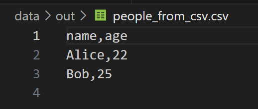
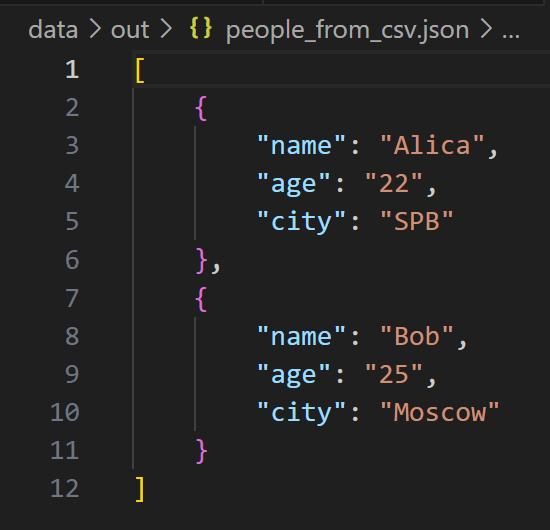

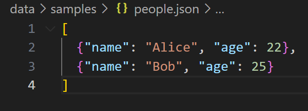

## Задание B — CSV → XLSX
``` 
import os
import csv
import sys
from pathlib import Path
from openpyxl import Workbook 

def csv_to_xlsx(csv_path: str, xlsx_path: str) -> None: 
    if not os.path.exists(csv_path):  
        print("FileNotFoundError") 
        sys.exit(1) #завершает программу с ошибкой 1
    xlsx_path=Path(xlsx_path)
    csv_path=Path(csv_path)
    if xlsx_path.suffix.lower() != ".xlsx": #получает расширение файла,преобразует в нижний регистр
        raise ValueError(f"Неверный формат выходного файла: ожидается .xlsx")
    if csv_path.suffix.lower() != ".csv":
        raise ValueError(f"Неверный формат входного файла: ожидается .csv")

    if os.path.getsize(csv_path) == 0: #получает размер файла в байтах
        print("ValueError")
        sys.exit(1)
    wb = Workbook() # c
    ws = wb.active  #получает активный лист
    ws.title = "Sheet1" #устанавливает название листа "Sheet1"

    with open(csv_path, "r", encoding="utf-8") as csv_file: 
        reader = csv.reader(csv_file) # создает объект для чтения CSV построчно
        for row in reader: 
            ws.append(row) 
    for column_cells in ws.columns: 
        max_length = 0 
        column_letter = column_cells[0].column_letter #получает букву колонки
        for cell in column_cells: 
            if cell.value: 
                max_length = max(max_length, len(str(cell.value))) 
        ws.column_dimensions[column_letter].width = max(max_length + 2, 8) #обращается к настройкам ширины конкретной колонки, устанавливает ширину колонки, максимальная длина + 2 символа для отступа, 8- выбирает большее значение между расчитанной шириной и минимальной шириной 8 
    wb.save(xlsx_path)
csv_to_xlsx(r"C:\Users\Home\lab_python\lab_python-2\data\samples\cities.csv", r"C:\Users\Home\lab_python\lab_python-2\data\out\people.xlsx")    
```
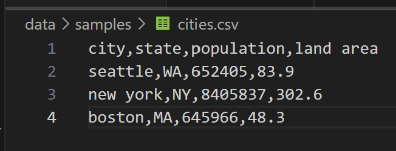
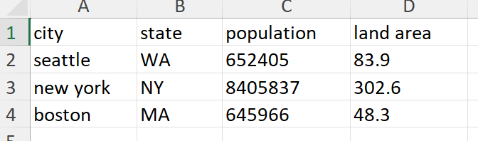

# ___Лабораторная работа 6___
## Задание A
```
import argparse
from pathlib import Path
from lib.text import tokenize, count_freq, top_n

def main():
    
    # создание объекта парсера с описанием программы
    parser = argparse.ArgumentParser(description="CLI-утилиты лабораторной №6")

   
    subparsers = parser.add_subparsers(dest="command", help="Доступные соманды")

    stats_parser = subparsers.add_parser("stats", help="Частоты слов в тексте")
    stats_parser.add_argument("--input", required=True, help="Входной текстовый файл")
    stats_parser.add_argument("--top", type=int, default=5, help="Количество топовых слов "
    "(по умолчанию: 5)")
    cat_parser = subparsers.add_parser("cat", help="Вывод содержимого файла")
    cat_parser.add_argument("--input", required=True, help="Путь к входному файлу")
    cat_parser.add_argument("-n", action="store_true", help="Нумеровать строки")

    args = parser.parse_args()

    file = Path(args.input) # создание объекта Path из переданного пути к файлу

    if not file.exists():
        parser.error("Файл не найден")
    
    if args.command == "cat": # реализация команды cat
        with open(file, "r", encoding="utf-8") as f:
            number = 1
            for row in f:
                row = row.rstrip("\n") 
                if args.n: # если указан флаг n -> печатаем пронумерованные строки, если нет, просто строки
                    print(f"{number}: {row}")
                    number += 1
                else:
                    print(row)

    elif args.command == "stats": # реализация команды stats
        with open(file, "r", encoding="utf-8") as f:
            data = [row for row in f]
        data = "".join(data)
        tokens = tokenize(text=data)
        freq = count_freq(tokens=tokens)
        top = top_n(freq=freq, n=args.top)

        # выводим топ слов
        number = 1
        for x, y in top:
            print(f"{number}. {x} - {y}")
            number += 1

if __name__ == "__main__":
    main()

```
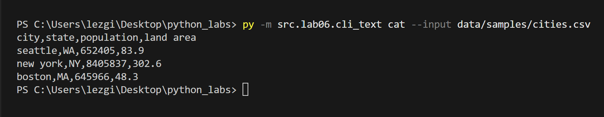
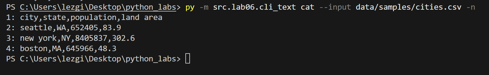
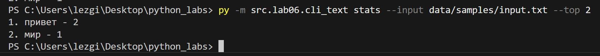


## Задание B
```

import argparse
from pathlib import Path
from lib.json_csv import json_to_csv, csv_to_json
from lib.csv_xlsx import csv_to_xlsx  

def main():
    parser = argparse.ArgumentParser(description="Конвертер данных между форматами")
    subparsers = parser.add_subparsers(dest="command", help="Доступные команды конвертации")

    # JSON → CSV
    json_to_csv_parser = subparsers.add_parser("json_to_csv", help="Конвертировать JSON в CSV")
    json_to_csv_parser.add_argument("--in", dest="input", required=True, help="Входной JSON файл")
    json_to_csv_parser.add_argument("--out", dest="output", required=True, help="Выходной CSV файл")

    # CSV → JSON
    csv_to_json_parser = subparsers.add_parser("csv_to_json", help="Конвертировать CSV в JSON")
    csv_to_json_parser.add_argument("--in", dest="input", required=True, help="Входной CSV файл")
    csv_to_json_parser.add_argument("--out", dest="output", required=True, help="Выходной JSON файл")

    # CSV → XLSX
    csv_to_xlsx_parser = subparsers.add_parser("csv_to_xlsx", help="Конвертировать CSV в XLSX")
    csv_to_xlsx_parser.add_argument("--in", dest="input", required=True, help="Входной CSV файл")
    csv_to_xlsx_parser.add_argument("--out", dest="output", required=True, help="Выходной XLSX файл")

    args = parser.parse_args()

    if args.command == "json_to_csv":
        json_to_csv(json_path=args.input, csv_path=args.output)

    elif args.command == "csv_to_json":
        csv_to_json(csv_path=args.input, json_path=args.output)

    elif args.command == "csv_to_xlsx":
        csv_to_xlsx(csv_path=args.input, xlsx_path=args.output)

if __name__ == "__main__":
    main()

```
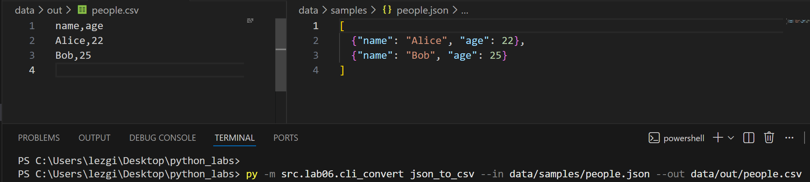
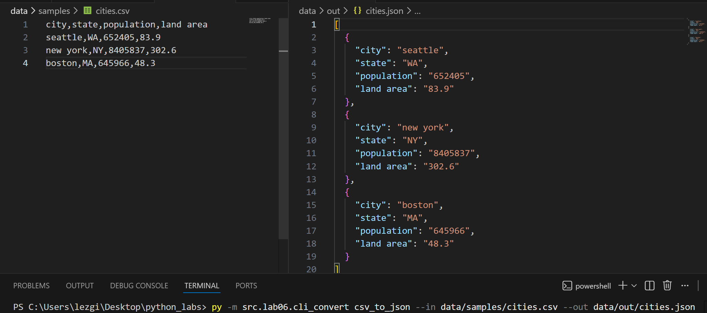

# ___Лабораторная работа 7___
## Задание text.py
```
import pytest
import sys
import os

# Добавляем корневую директорию проекта в путь
project_root = os.path.dirname(os.path.dirname(os.path.abspath(__file__)))
sys.path.insert(0, project_root)

from src.lib.text import normalize, tokenize, count_freq, top_n


@pytest.mark.parametrize(
    "source, expected",
    [
        ("ПрИвЕт\nМИр\t", "привет мир"),
        ("ёжик, Ёлка", "ежик, елка"),
        ("Hello\r\nWorld", "hello world"),
        ("  двойные   пробелы  ", "двойные пробелы"),
        ("", ""),
        ("   ", ""),
    ],
)
def test_normalize(source, expected):
    assert normalize(source) == expected


@pytest.mark.parametrize(
    "text, expected",
    [
        ("привет мир", ["привет", "мир"]),
        ("hello world test", ["hello", "world", "test"]),
        ("", []),
        ("   ", []),
        ("знаки, препинания! тест.", ["знаки", "препинания", "тест"]),
    ],
)
def test_tokenize(text, expected):
    assert tokenize(text) == expected


def test_count_freq_basic():
    tokens = ["apple", "banana", "apple", "cherry", "banana", "apple"]
    result = count_freq(tokens)
    expected = {"apple": 3, "banana": 2, "cherry": 1}
    assert result == expected


def test_count_freq_empty():
    assert count_freq([]) == {}


def test_top_n_basic():
    freq = {"apple": 5, "banana": 3, "cherry": 7, "date": 1}
    result = top_n(freq, 2)
    expected = [("cherry", 7), ("apple", 5)]
    assert result == expected


def test_top_n_tie_breaker():
    freq = {"banana": 3, "apple": 3, "cherry": 3}
    result = top_n(freq, 3)
    expected = [("apple", 3), ("banana", 3), ("cherry", 3)]
    assert result == expected


def test_top_n_empty():
    assert top_n({}, 5) == []


def test_full_pipeline():
    text = "Привет мир! Привет всем. Мир прекрасен."
    normalized = normalize(text)
    tokens = tokenize(normalized)
    freq = count_freq(tokens)
    top_words = top_n(freq, 2)

    assert normalized == "привет мир! привет всем. мир прекрасен."
    assert tokens == [
        "привет",
        "мир",
        "привет",
        "всем",
        "мир",
        "прекрасен",
    ]
    assert freq == {"привет": 2, "мир": 2, "всем": 1, "прекрасен": 1}
    assert top_words == [("мир", 2), ("привет", 2)]
```
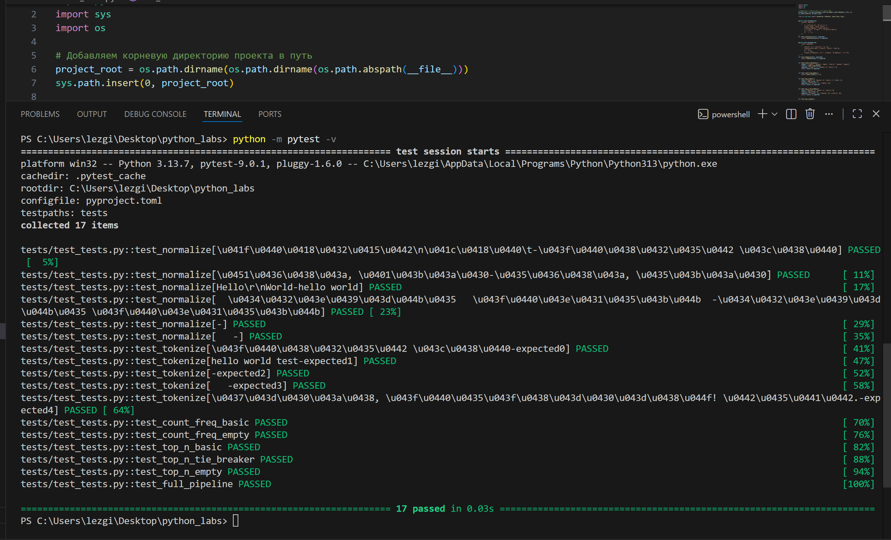

## Задание json_csv.py
```
import sys
import os

# Добавляем путь к проекту для импорта
current_dir = os.path.dirname(os.path.abspath(__file__))
project_root = os.path.dirname(current_dir)
sys.path.insert(0, project_root)

import pytest
import csv
import json
from pathlib import Path
from src.lab05.json_csv import json_to_csv, csv_to_json


def test_json_to_csv_roundtrip(tmp_path: Path):
    src = tmp_path / "people.json"
    dst = tmp_path / "people.csv"
    data = [
        {"name": "Alice", "age": 22},
        {"name": "Bob", "age": 25},
    ]
    src.write_text(json.dumps(data, ensure_ascii=False, indent=2), encoding="utf-8")
    json_to_csv(str(src), str(dst))
    with dst.open(encoding="utf-8") as f:
        rows = list(csv.DictReader(f))
    assert len(rows) == 2
    assert {"name", "age"} <= set(rows[0].keys())


def test_csv_to_json_roundtrip(tmp_path: Path):
    src = tmp_path / "people.csv"
    dst = tmp_path / "people.json"
    data = [
        {"name": "Alice", "age": "22"},
        {"name": "Bob", "age": "25"},
    ]
    with open(src, "w", newline="", encoding="utf-8") as f:
        fieldnames = list(data[0].keys())
        writer = csv.DictWriter(f, fieldnames=fieldnames)
        writer.writeheader()
        writer.writerows(data)
    csv_to_json(str(src), str(dst))
    with dst.open(encoding="utf-8") as f:
        rows = json.load(f)
    assert len(rows) == 2


@pytest.mark.parametrize(
    "function, input_file, error",
    [
        (json_to_csv, "people.json", ValueError),
    ],
)
def test_error_handling(function, input_file, error, tmp_path: Path):
    file_path = tmp_path / input_file
    file_path.write_text("Error???", encoding="utf-8")
    dst = tmp_path / "people.csv"
    f = json_to_csv if function is json_to_csv else csv_to_json
    with pytest.raises(error):
        f(str(file_path), str(dst))

```
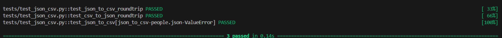

## black
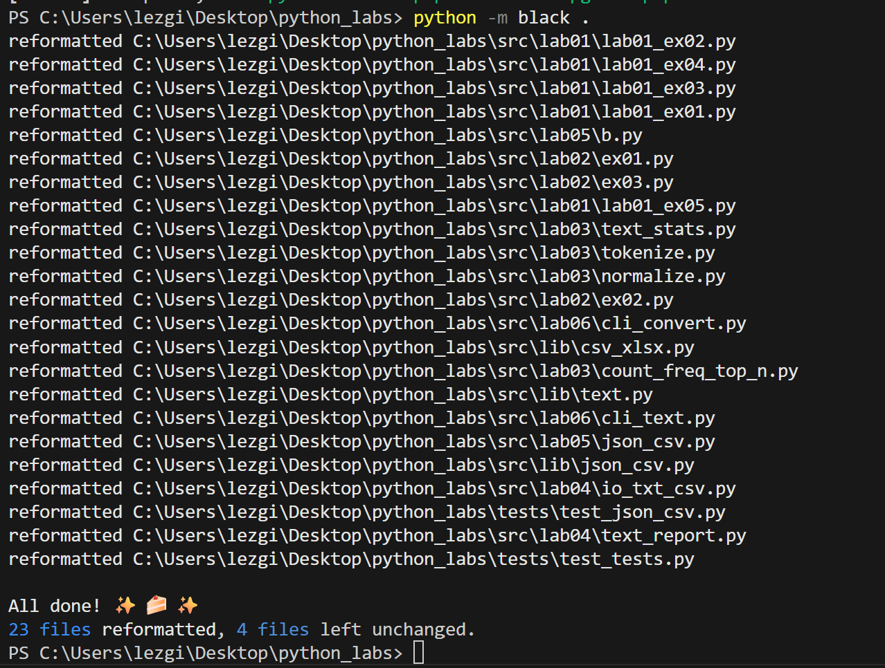

# ___Лабораторная работа 8___
## models.py
``` 
from dataclasses import dataclass
from datetime import datetime, date
import re

@dataclass
class Student:
    fio: str
    birthdate: str
    group: str
    gpa: float
    
    def __post_init__(self):
        if not re.match(r'^\d{4}-\d{2}-\d{2}$', self.birthdate):
            raise ValueError(f"Неверный формат даты: {self.birthdate}. Используйте формат YYYY-MM-DD")
        try:
            datetime.strptime(self.birthdate, "%Y-%m-%d")
        except ValueError:
            raise ValueError(f"Неверная дата: {self.birthdate}")
        if not (0 <= self.gpa <= 5):
            raise ValueError(f"Средний балл должен быть в диапазоне от 0 до 5, получено: {self.gpa}")
        if len(self.fio.split()) < 2:
            raise ValueError(f"ФИО должно содержать имя и фамилию: {self.fio}")
    
    def age(self) -> int:
        birth_date = datetime.strptime(self.birthdate, "%Y-%m-%d").date()
        today = date.today()
        
        age = today.year - birth_date.year
        
        if (today.month, today.day) < (birth_date.month, birth_date.day):
            age -= 1
            
        return age
    
    def to_dict(self) -> dict:
        return {
            "fio": self.fio,
            "birthdate": self.birthdate,
            "group": self.group,
            "gpa": self.gpa
        }
    
    @classmethod
    def from_dict(cls, data: dict):
        return cls(
            fio=data.get("fio", ""),
            birthdate=data.get("birthdate", ""),
            group=data.get("group", ""),
            gpa=data.get("gpa", 0.0)
        )
    
    def __str__(self) -> str:
        return f"{self.fio}, группа: {self.group}, возраст: {self.age()}, средний балл: {self.gpa}"


if __name__ == "__main__":
    try:
        student = Student(
            fio="Иванов Иван Иванович",
            birthdate="2007-10-06",
            group="БИВТ-25-1",
            gpa=3.5
        )
        print(student)
        print(f"Словарь: {student.to_dict()}")
    except ValueError as e:
        print(f"Ошибка: {e}")

```
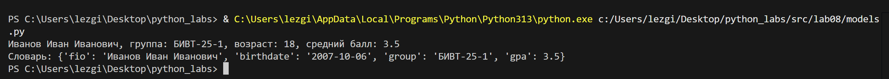

## serialize.p
``` 
import json
from typing import List
from models import Student
def students_to_json(students: List[Student], path: str) -> None:
    data = [student.to_dict() for student in students]
    with open(path, 'w', encoding='utf-8') as f:
        json.dump(data, f, ensure_ascii=False, indent=2)
    print(f"Данные сохранены в {path}")
def students_from_json(path: str) -> List[Student]:
    try:
        with open(path, 'r', encoding='utf-8') as f:
            data = json.load(f)
        students = []
        for item in data:
            try:
                student = Student.from_dict(item)
                students.append(student)
            except ValueError as e:
                print(f"Не удалось создать студента из записи {item}: {e}")
        print(f"Загружено {len(students)} студентов из {path}")
        return students   
    except FileNotFoundError:
        print(f"Файл {path} не найден")
        return []
    except json.JSONDecodeError as e:
        print(f"Ошибка при чтении JSON файла: {e}")
        return []
if __name__ == "__main__": 
    students = [
        Student("Иванов Иван Иванович", "2007-02-19", "БИВТ-25-1", 3.5),
        Student("Петров Петр Петрович", "2006-12-12", "БИВТ-25-2", 4.5),
        Student("Семёнов Семён Семёнович", "2007-03-10", "БИВТ-25-3", 4.9)
    ]
    students_to_json(students, "data/students_output.json")
    loaded_students = students_from_json("data/students_input.json")
    for student in loaded_students:
        print(student)
    
```

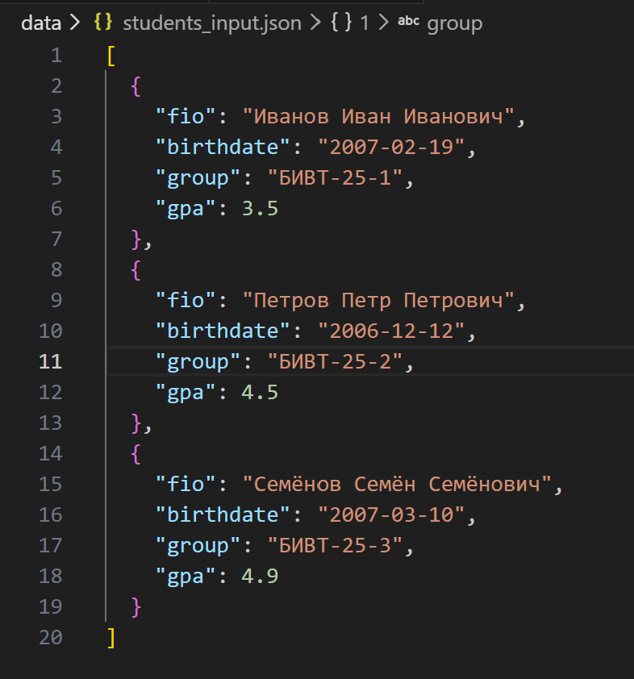
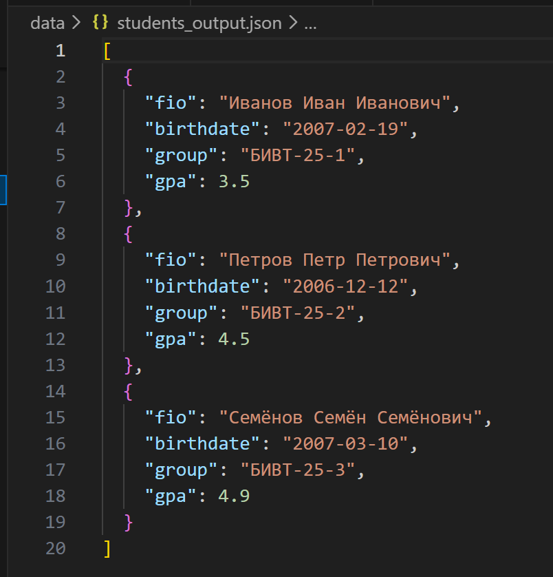

