# __Лабораторная работа 1__
## задание 1
```
a = input()
b = int(input())
c = b + 1
print(f"Привет, {a}! Через год тебе будет {c}.")
```
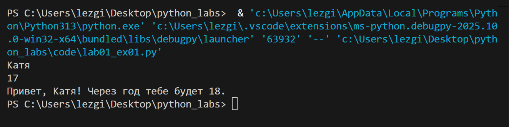
## задание 2
```
a = float(input())
b = float(input())
summ = a + b
avg = round((a + b)/2, 2)
print(f"sum={summ}; avg={avg}")
```
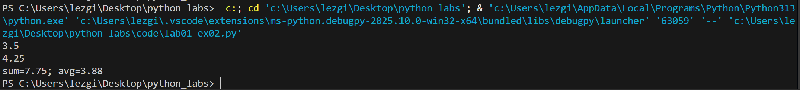
## задание 3
```
price = float(input())
discount = float(input())
vat = float(input())

base = round(price * (1 - discount/100), 2)
vat_amount = round(base * (vat/100), 2)
total = round(base + vat_amount, 2)

print(f"База после скидки: {base} ₽")
print(f"НДС: {vat_amount} ₽")
print(f"Итого к оплате: {total} ₽")
```
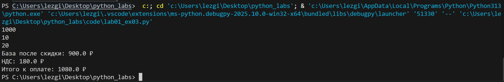
## задание 4
```
min = int(input())
hours = min//60
ost_min = min%60
print(f"{hours} : {ost_min:02d}")
```
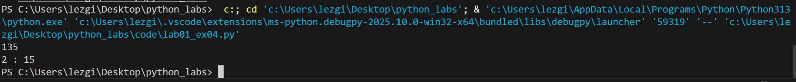
## задание 5
```
name = input().strip()
nam = name.split()
m = len(''.join(nam))+2
n = []
for i in nam:
    a = i[0]
    n.append(a)
h = ''.join(n)
print(f"Инициалы: {h}.")
print(f"Длина (символов): {m}")
```
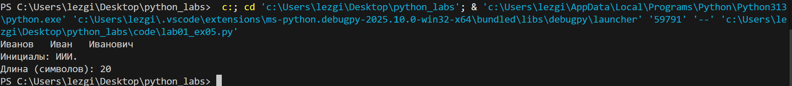


# __Лабораторная работа 2__
## задание 1 
```
def min_max(nums: list[float | int]) -> tuple[float | int, float | int]:
    if not nums:
        return ValueError
    return (min(nums), max(nums))
print(min_max([3, -1, 5, 5, 0]))
print(min_max([42]))
print(min_max([-5, -2, -9]))
print(min_max([ ]))
print(min_max([1.5, 2, 2.0, -3.1]))

def unique_sorted(nums: list[float | int]) -> list[float | int]:
    return sorted(set(nums))
print(unique_sorted([3, 1, 2, 1, 3]))
print(unique_sorted([]))
print(unique_sorted([-1, -1, 0, 2, 2]))
print(unique_sorted([1.0, 1, 2.5, 2.5, 0]))

def flatten(mat: list[list | tuple]) -> list:
    res = []
    for x in mat:
        if not isinstance(x, (list, tuple)):
            return ValueError
        res.extend(x)
    return res

print(flatten([[1, 2], [3, 4]]))
print(flatten([[1, 2], (3, 4, 5)]))
print(flatten([[1], [], [2, 3]]))
print(flatten([[1, 2], "ab"]))
```
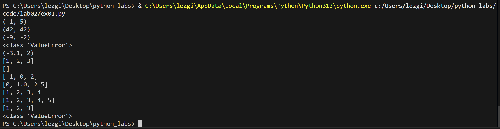

## задание 2 
```
def transpose(mat: list[list[float | int]]) -> list[list]:
    if not mat:
        return []
    rv_l = len(mat[0])
    for rv in mat:
        if len(rv) != rv_l:
            return ValueError
    return [[mat[j][i] for j in range(len(mat))] for i in range(rv_l)]

print(transpose([[1, 2, 3]]))
print(transpose([[1], [2], [3]]))
print(transpose([[1, 2], [3, 4]]))
print(transpose([]))
print(transpose([[1, 2], [3]]))

def row_sums(mat: list[list[float | int]]) -> list[float]:
    if not mat:
        return []
    
    row_length = len(mat[0])
    for row in mat:
        if len(row) != row_length:
            return ValueError
    
    return [sum(row) for row in mat]
print(row_sums([[1, 2, 3], [4, 5, 6]]))
print(row_sums([[-1, 1], [10, -10]]))
print(row_sums([[0, 0], [0, 0]]))
print(row_sums([[1, 2], [3]]))

def col_sums(mat: list[list[float | int]]) -> list[float]:
    if not mat:
        return []
    
    row_length = len(mat[0])
    for row in mat:
        if len(row) != row_length:
            return ValueError
    
    return [sum(mat[i][j] for i in range(len(mat))) for j in range(row_length)]

print(col_sums([[1, 2, 3], [4, 5, 6]]))
print(col_sums([[-1, 1], [10, -10]]))
print(col_sums([[0, 0], [0, 0]]))
print(col_sums([[1, 2], [3]]))
```
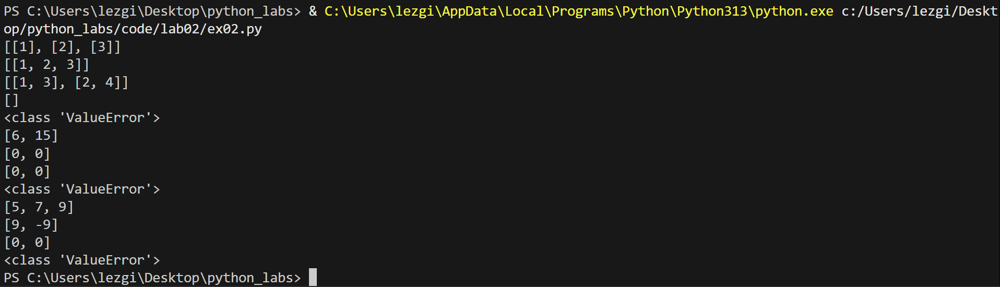

## задание 3 
```
def format_record(rec:tuple[str,str,float])-> str:
    fio,group,gpa=rec
    part_fio=[part.strip() for part in fio.split() if part.strip()]
    ini=[]
    for part in part_fio[1:]:
        if part:
            ini.append(f"{part[0].upper()}.")
    res_fio=f"{part_fio[0]} {''.join(ini)}"
    res_gpa=f"{gpa:.2f}"
    return f"{res_fio}, гр. {group}, GPA {res_gpa}"
print(format_record(("Иванов Иван Иванович", "BIVT-25", 4.6) ))
print(format_record(("Петров Пётр", "IKBO-12", 5.0)))
print(format_record(("Петров Пётр Петрович", "IKBO-12", 5.0)))
print(format_record(("  сидорова  анна   сергеевна ", "ABB-01", 3.999)))

```
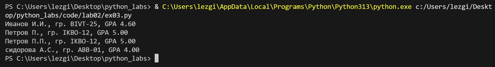

# __Лабораторная работа 3__
## normalize
```
def normalize(text: str, *, casefold: bool = True, yo2e: bool = True) -> str:
    text = text.casefold() 
    if yo2e:
        text = text.replace('ё', 'е').replace('Ё', 'Е')
    text = text.replace('\t', ' ').replace('\r', ' ').replace('\n', ' ')
    text = " ".join(text.split()) 
    text = text.strip() 
    return text

print(normalize("ПрИвЕт\nМИр\t")) 
print(normalize("ёжик, Ёлка"))
print(normalize("Hello\r\nWorld"))
print(normalize("  двойные   пробелы  "))
```
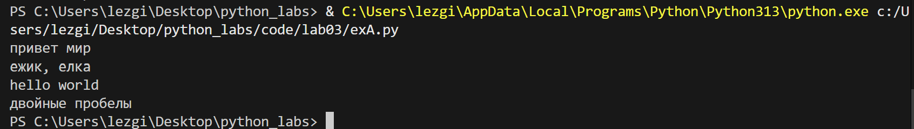

## tokenize
```
import re
def tokenize(text: str) -> list[str]:
    return re.findall(r'\w+(?:-\w+)*', text)  

print(tokenize("привет мир"))
print(tokenize("hello,world!!!"))
print(tokenize("по-настоящему круто"))
print(tokenize("2025 год"))
print(tokenize("emoji 😀 не слово"))

```
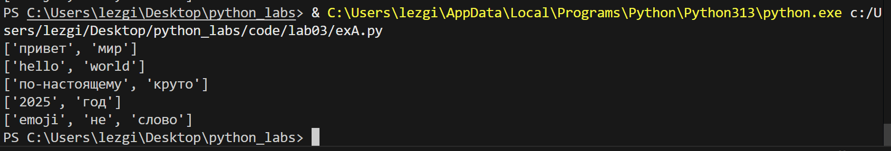

## count_freq + top_n
``` 
def count_freq(tokens: list[str]) -> dict[str, int]:
    c = {}  
    for w in tokens:
        cu = c.get(w, 0) 
        c[w] = cu + 1
    return c
def top_n(freq: dict[str, int], n: int = 5) -> list[tuple[str, int]]:
    t = []
    for w, count in freq.items():
        t.append((-count, w))
    t.sort()
    result = []
    for neg_count, w in t:
        result.append((w, -neg_count))
    return result[:n]
tok = ["a", "b", "a", "c", "b", "a"]
freq = count_freq(tok)
print(top_n(freq, n=2))
tok_2 = ["bb", "aa", "bb", "aa", "cc"]
freq_2 = count_freq(tok_2)
print(top_n(freq_2, n=2))

```
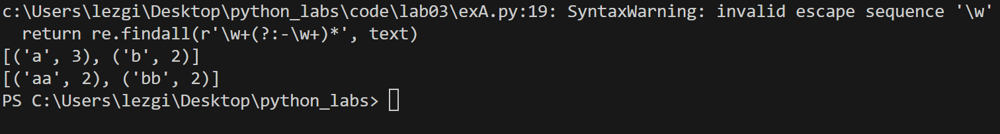

## text_stats
``` 
import sys
import re
from lib.text import normalize, tokenize, count_freq, top_n

a = str(input())
n =normalize(a) 
allwords = tokenize(n) 
uw = count_freq(allwords) 
top = top_n(uw,5) 
print(f'Всего слов: {len(allwords)}') 
print(f"Уникальных слов: {len(uw)}")
print("Топ-5:")
for y in top:
    print(y[0] + ': ' + str(y[1]))

```
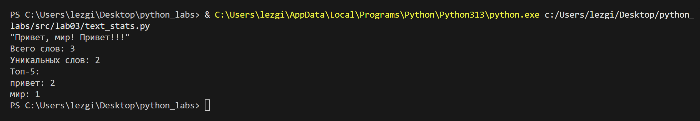

# __Лабораторная работа 4__
## Задание A — модуль src/lab04/io_txt_csv.py
```
import csv
from pathlib import Path
from typing import Iterable, Sequence

def read_text(path: str | Path, encoding: str = "utf-8") -> str:
    try:
        return Path(path).read_text(encoding=encoding)
    except FileNotFoundError:
        return "Такого файла нету"
    except UnicodeDecodeError:
        return "Неудалось изменить кодировку"

def write_csv(rows: list[tuple | list], path: str | Path, header: tuple[str, ...] | None = None) -> None:
    p = Path(path)
    with p.open('w', newline="", encoding="utf-8") as file: # контроль переноса строк,кодироввка файла
        f = csv.writer(file)
        if header is None and rows == []: # нет заголовка и данных
            file_c.writerow(('a', 'b')) 
        if header is not None:
            f.writerow(header)
        if rows != []:
            const = len(rows[0])
            for i in rows:
                if len(i) != const:
                    return ValueError
        f.writerows(rows)

def ensure_parent_dir(path: str | Path) -> None:
    Path(path).parent.mkdir(parents=True, exist_ok=True)

print(read_text(r"C:\Users\lezgi\Desktop\python_labs\data\lab04\input.txt"))
write_csv([("word","count"),("test",3)], r"C:\Users\lezgi\Desktop\python_labs\data\lab04\check.csv") 

```
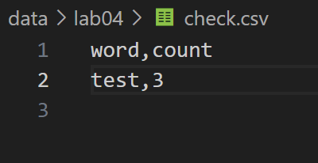

## Задание B — скрипт src/lab04/text_report.py
```
from io_txt_csv import read_text, write_csv, ensure_parent_dir
import sys
from pathlib import Path

sys.path.append(r'C:\Users\Home\Documents\GitHub\lab_01\lib')

from lib.text import normalize, tokenize, count_freq, top_n


def exist_path(path_f: str):
    return Path(path_f).exists() #существует ли файл 


def main(file: str, encoding: str = 'utf-8'): 
    if not exist_path(file):
        raise FileNotFoundError 
    
    file_path = Path(file)
    text = read_text(file, encoding=encoding) # текст в одну строку
    norm = normalize(text) 
    tokens = tokenize(norm)
    freq_dict = count_freq(tokens)
    top = top_n(freq_dict, 5)
    top_sort = sorted(top, key=lambda x: (x[1], x[0]), reverse=True) # сортирует список, критерии сортировки, частота слово и само слово, сортировка по убыванию
    report_path = file_path.parent / 'report.csv' # cоздает путь для файла отчета в той же папке, где исходный файл
    write_csv(top_sort, report_path, header=('word', 'count'))
    
    print(f'Всего слов: {len(tokens)}')
    print(f'Уникальных слов: {len(freq_dict)}')
    print('Топ-5:')
    for cursor in top_sort:
        print(f'{cursor[0]}: {cursor[-1]}')


main(r'C:\Users\lezgi\Desktop\python_labs\data\lab04\input.txt')

```
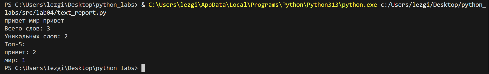
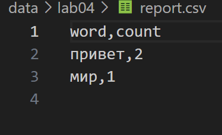